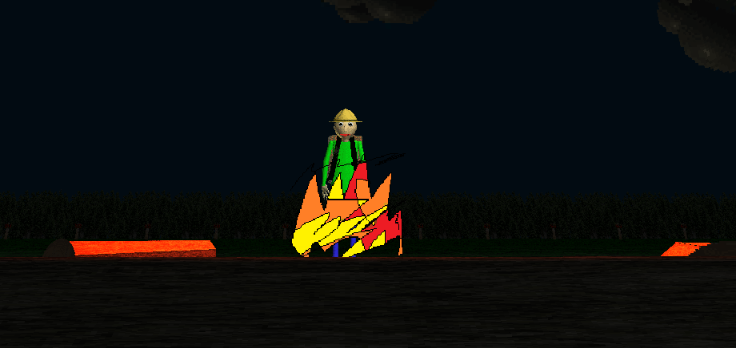

# Baldi's Basics Camping Demo V1.1 Decompile
A decompile of BBCD V1.1

[Download Camping Demo here! (Unofficial)](https://aidansstuff.itch.io/baldis-basics-field-trip-demo-camping-reupload)

[Download Project Files](https://github.com/SillyMonkeyFlip/Baldi-s-Basics-Camping-Demo-V1.1-Decompile/releases)

[Play WebGL Version](https://sillymonkeyflip.github.io/Baldi-s-Basics-Camping-Demo-V1.1-Decompile/)

## Information
- Unity version is 2022.3.62 (Converted by me, you should be able to downgrade it tho)
- Scriping backend is mono

## Credits
- Mystman12 - Creating Baldis Basics
- [Aidans Stuff](https://aidansstuff.itch.io) - Archive
- SillyMonkeyFlip - Decompile + WebGL Compile

## Media

